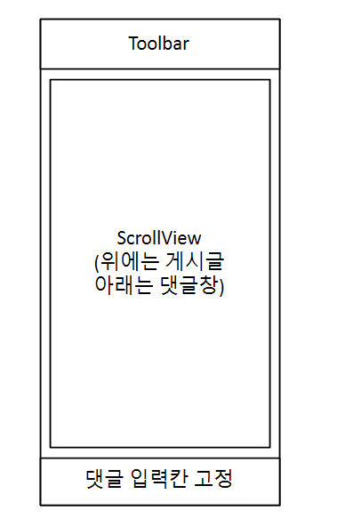

# 2조 프로젝트 문서

---

## 팀정보

---
* 팀 이름 : 2조
* 조장 : 장세훈
* 팀원 : 김성진, 차승환

---
# 댓글 기능 구현

 

### 작업순서

---
1. BoardReadFragment.kt 에서 보여 져야 하므로 여기에 추가할 예정
2. fragment_board_read.xml 파일에 댓글을 작성하고 보여지도록 수정
3. 댓글이 보여지도록 row_comment_list.xml 을 생성
   1. 작성자 이름
   2. 작성 내용
   3. 작성 날짜 및 시간
   4. 작성자에 한해 수정과 삭제할 수 있는 기능
4. 작성자에 한해 수정과 삭제할 수 있는 기능을 만들기 위해 menu 파일에 menu_comment.xml 파일 추가
5. BoardReadFragment.kt 에 코드 추가
6. 키보드 위로 댓글작성란이 올라오도록 AndroidMainifest.xml 파일에 코드 추가
7. 저장과 기능을 구현하기 위해 RowCommentListViewModel.kt, ReplyService.kt, ReplyRepository.kt 파일 추가 및 수정

## fragment_board_read.xml 파일에 댓글을 작성하고 보여지도록 수정

---
* 댓글 작성과 작성한 댓글을 보기 위해서 코드 수정
  * NestedScrollView 를 사용하여 위에는 게시글 내용 아래는 댓글까지 스크롤하여 볼 수 있도록 함
  * 하단에 댓글 작성란을 추가

```xml
<layout xmlns:android="http://schemas.android.com/apk/res/android"
    xmlns:app="http://schemas.android.com/apk/res-auto"
    xmlns:tools="http://schemas.android.com/tools">

    <data>
        <variable
            name="boardReadViewModel"
            type="com.lion.boardproject.viewmodel.BoardReadViewModel" />
    </data>

    <androidx.constraintlayout.widget.ConstraintLayout
        android:layout_width="match_parent"
        android:layout_height="match_parent"
        android:transitionGroup="true"
        android:padding="0dp">

        <com.google.android.material.appbar.MaterialToolbar
            android:id="@+id/toolbarBoardRead"
            android:layout_width="match_parent"
            android:layout_height="?attr/actionBarSize"
            android:theme="?attr/actionBarTheme"
            app:menu="@menu/menu_board_read_toolbar"
            app:navigationIcon="@drawable/arrow_back_24px"
            app:title="글 읽기"
            app:layout_constraintTop_toTopOf="parent"
            app:layout_constraintStart_toStartOf="parent"
            app:layout_constraintEnd_toEndOf="parent"
            app:onNavigationClickBoardRead="@{boardReadViewModel.boardReadFragment}" />

        <androidx.core.widget.NestedScrollView
            android:id="@+id/nestedScrollView"
            android:layout_width="match_parent"
            android:layout_height="0dp"
            android:fillViewport="true"
            app:layout_constraintTop_toBottomOf="@id/toolbarBoardRead"
            app:layout_constraintBottom_toTopOf="@+id/linearLayoutCommentInput"
            app:layout_constraintStart_toStartOf="parent"
            app:layout_constraintEnd_toEndOf="parent">

            <LinearLayout
                android:layout_width="match_parent"
                android:layout_height="wrap_content"
                android:orientation="vertical"
                android:padding="10dp"
                android:transitionGroup="false">

                <com.google.android.material.textfield.TextInputLayout
                    android:id="@+id/textFieldBoardReadTitle"
                    android:layout_width="match_parent"
                    android:layout_height="wrap_content"
                    android:hint="제목"
                    app:startIconDrawable="@drawable/subject_24px">

                    <com.google.android.material.textfield.TextInputEditText
                        android:layout_width="match_parent"
                        android:layout_height="wrap_content"
                        android:enabled="false"
                        android:text="@{boardReadViewModel.textFieldBoardReadTitleText}"
                        android:textColor="@color/black" />
                </com.google.android.material.textfield.TextInputLayout>

                <com.google.android.material.textfield.TextInputLayout
                    android:id="@+id/textFieldBoardReadNickName"
                    android:layout_width="match_parent"
                    android:layout_height="wrap_content"
                    android:layout_marginTop="10dp"
                    android:hint="작성자"
                    app:startIconDrawable="@drawable/person_add_24px">

                    <com.google.android.material.textfield.TextInputEditText
                        android:layout_width="match_parent"
                        android:layout_height="wrap_content"
                        android:enabled="false"
                        android:text="@{boardReadViewModel.textFieldBoardReadNickName}"
                        android:textColor="@color/black" />
                </com.google.android.material.textfield.TextInputLayout>

                <com.google.android.material.textfield.TextInputLayout
                    android:id="@+id/textFieldBoardReadType"
                    android:layout_width="match_parent"
                    android:layout_height="wrap_content"
                    android:layout_marginTop="10dp"
                    android:hint="게시판"
                    app:startIconDrawable="@drawable/format_list_bulleted_24px">

                    <com.google.android.material.textfield.TextInputEditText
                        android:layout_width="match_parent"
                        android:layout_height="wrap_content"
                        android:enabled="false"
                        android:text="@{boardReadViewModel.textFieldBoardReadTypeText}"
                        android:textColor="@color/black" />
                </com.google.android.material.textfield.TextInputLayout>

                <com.google.android.material.textfield.TextInputLayout
                    android:id="@+id/textFieldBoardReadText"
                    android:layout_width="match_parent"
                    android:layout_height="wrap_content"
                    android:layout_marginTop="10dp"
                    android:hint="내용"
                    app:startIconDrawable="@drawable/description_24px">

                    <com.google.android.material.textfield.TextInputEditText
                        android:layout_width="match_parent"
                        android:layout_height="wrap_content"
                        android:enabled="false"
                        android:text="@{boardReadViewModel.textFieldBoardReadTextText}"
                        android:textColor="@color/black" />
                </com.google.android.material.textfield.TextInputLayout>

                <ImageView
                    android:id="@+id/imageViewBoardRead"
                    android:layout_width="match_parent"
                    android:layout_height="wrap_content"
                    android:layout_marginTop="10dp"
                    android:adjustViewBounds="true"
                    android:src="@drawable/panorama_24px" />

                <View
                    android:layout_width="match_parent"
                    android:layout_height="1dp"
                    android:layout_marginTop="10dp"
                    android:layout_marginBottom="10dp"
                    android:background="@android:color/darker_gray" />

                <TextView
                    android:id="@+id/textViewCommentLabel"
                    android:layout_width="match_parent"
                    android:layout_height="wrap_content"
                    android:text="댓글 목록"
                    android:textAppearance="@style/TextAppearance.AppCompat.Large"
                    tools:layout_marginBottom="10dp" />

                <TextView
                    android:id="@+id/textViewNoComments"
                    android:layout_width="match_parent"
                    android:layout_height="wrap_content"
                    android:gravity="center"
                    android:visibility="gone"
                    android:layout_marginTop="10dp"
                    android:text="댓글이 없습니다."
                    android:textAppearance="@style/TextAppearance.AppCompat.Medium"
                    android:textColor="@android:color/darker_gray" />

                <androidx.recyclerview.widget.RecyclerView
                    android:id="@+id/recyclerViewComments"
                    android:layout_width="match_parent"
                    android:layout_height="wrap_content"
                    android:nestedScrollingEnabled="false" />
            </LinearLayout>
        </androidx.core.widget.NestedScrollView>

        <LinearLayout
            android:id="@+id/linearLayoutCommentInput"
            android:layout_width="match_parent"
            android:layout_height="wrap_content"
            android:background="#FCF5FD"
            android:fillViewport="true"
            android:focusableInTouchMode="true"
            android:orientation="horizontal"
            app:layout_constraintBottom_toBottomOf="parent"
            app:layout_constraintEnd_toEndOf="parent"
            app:layout_constraintStart_toStartOf="parent"
            app:layout_constraintTop_toBottomOf="@+id/nestedScrollView">

            <com.google.android.material.textfield.TextInputLayout
                android:id="@+id/textFieldCommentInput"
                android:layout_width="0dp"
                android:layout_height="wrap_content"
                android:layout_weight="1"
                android:hint="댓글 작성"
                app:startIconDrawable="@drawable/chat_24px">

                <com.google.android.material.textfield.TextInputEditText
                    android:id="@+id/editTextCommentInput"
                    android:layout_width="match_parent"
                    android:layout_height="match_parent"
                    android:singleLine="true" />
            </com.google.android.material.textfield.TextInputLayout>

            <Button
                android:id="@+id/buttonSubmitComment"
                android:layout_width="wrap_content"
                android:layout_height="wrap_content"
                android:layout_marginStart="10dp"
                android:text="작성" />
        </LinearLayout>

    </androidx.constraintlayout.widget.ConstraintLayout>
</layout>

```
## 댓글이 보여지도록 row_comment_list.xml 을 생성

---
* 댓글 작성자 닉네임
* 댓글 작성 내용
* 댓글 작성 시간
* 수정 및 삭제를 위한 imageView

```xml
<?xml version="1.0" encoding="utf-8"?>
<layout
    xmlns:android="http://schemas.android.com/apk/res/android">

    <data>
        <variable
            name="rowCommentListViewModel"
            type="com.lion.boardproject.viewmodel.RowCommentListViewModel" />
    </data>

    <LinearLayout
        android:layout_width="match_parent"
        android:layout_height="wrap_content"
        android:orientation="horizontal"
        android:padding="10dp"
        android:transitionGroup="true">

        <ImageView
            android:id="@+id/imageViewProfile"
            android:layout_width="40dp"
            android:layout_height="40dp"
            android:layout_gravity="center_vertical"
            android:contentDescription="프로필 이미지"
            android:src="@drawable/face_24px" />

        <LinearLayout
            android:layout_width="0dp"
            android:layout_height="wrap_content"
            android:layout_marginStart="10dp"
            android:layout_weight="1"
            android:orientation="vertical">

            <TextView
                android:id="@+id/textViewRowCommentListName"
                android:layout_width="wrap_content"
                android:layout_height="wrap_content"
                android:text="@{rowCommentListViewModel.textViewRowCommentListNameText}"
                android:textAppearance="@style/TextAppearance.AppCompat.Medium"
                android:textStyle="bold" />

            <TextView
                android:id="@+id/textViewRowCommentListComment"
                android:layout_width="wrap_content"
                android:layout_height="wrap_content"
                android:layout_marginTop="5dp"
                android:text="@{rowCommentListViewModel.textViewRowCommentListCommentText}"
                android:textAppearance="@style/TextAppearance.AppCompat.Small" />

            <TextView
                android:id="@+id/textViewRowCommentListTime"
                android:layout_width="wrap_content"
                android:layout_height="wrap_content"
                android:layout_marginTop="5dp"
                android:text="@{rowCommentListViewModel.textViewRowCommentListTimeText}"
                android:textAppearance="@style/TextAppearance.AppCompat.Small"
                android:textColor="@android:color/darker_gray" />
        </LinearLayout>

        <ImageView
            android:id="@+id/menuIcon"
            android:layout_width="wrap_content"
            android:layout_height="wrap_content"
            android:layout_gravity="center_vertical"
            android:contentDescription="더보기"
            android:padding="8dp"
            android:src="@drawable/more_vert_24px" />
    </LinearLayout>

</layout>
```

## menu_comment.xml 파일 추가

---

```xml
<menu xmlns:android="http://schemas.android.com/apk/res/android">
    <item
        android:id="@+id/menuCommentEdit"
        android:title="수정"
        android:icon="@drawable/edit_24px"/>

    <item
        android:id="@+id/menuCommentDelete"
        android:title="삭제"
        android:icon="@drawable/delete_24px"/>
</menu>
```

## BoardReadFragment.kt 파일에 댓글 관련 코드 추가

---
* 댓글 관련 리사이클러뷰 어댑터 및 설정 메서드 추가
* 댓글 작성 메서드 추가
  * 작성자 이름은 로그인 한 사용자 닉네임으로 저장
* 댓글 목록을 서버에서 가져오는 메서드 추가
* 날짜를 저장하기 위해 날짜 형식 변환 메서드 추가
* 댓글 수정, 삭제 메뉴를 표시하는 메서드
  * 해당 댓글을 작성한 사람만 수정 및 삭제를 할 수 있도록 설정
* 댓글 수정 다이얼로그를 띄워주는 메서드 추가
* 댓글 삭제 메서드 추가
* 댓글을 새로고침하여 업데이트 해주는 메서드 추가
* 키보드가 댓글 작성란을 가리는 문제를 해결하기 위한 메서드 추가

```kt
package com.lion.boardproject.fragment

import android.content.DialogInterface
import android.graphics.Rect
import android.os.Bundle
import android.widget.EditText
import android.widget.PopupMenu
import androidx.fragment.app.Fragment
import android.view.LayoutInflater
import android.view.View
import android.view.ViewGroup
import androidx.core.view.children
import androidx.core.view.isVisible
import androidx.databinding.DataBindingUtil
import androidx.recyclerview.widget.LinearLayoutManager
import androidx.recyclerview.widget.RecyclerView
import com.google.android.material.dialog.MaterialAlertDialogBuilder
import com.google.android.material.divider.MaterialDividerItemDecoration
import com.lion.boardproject.BoardActivity
import com.lion.boardproject.R
import com.lion.boardproject.databinding.FragmentBoardReadBinding
import com.lion.boardproject.databinding.RowCommentListBinding
import com.lion.boardproject.model.BoardModel
import com.lion.boardproject.model.ReplyModel
import com.lion.boardproject.service.BoardService
import com.lion.boardproject.service.ReplyService
import com.lion.boardproject.viewmodel.BoardReadViewModel
import com.lion.boardproject.viewmodel.RowCommentListViewModel
import kotlinx.coroutines.CoroutineScope
import kotlinx.coroutines.Dispatchers
import kotlinx.coroutines.launch
import kotlinx.coroutines.withContext
import android.text.format.DateFormat
import android.view.ViewTreeObserver
import kotlinx.coroutines.async

class BoardReadFragment(val boardMainFragment: BoardMainFragment) : Fragment() {

    lateinit var fragmentBoardReadBinding: FragmentBoardReadBinding
    lateinit var boardActivity: BoardActivity

    // 현재 글의 문서 id를 담을 변수
    lateinit var boardDocumentId: String

    // 글 데이터를 담을 변수
    lateinit var boardModel: BoardModel

    override fun onCreateView(inflater: LayoutInflater, container: ViewGroup?, savedInstanceState: Bundle?): View? {
        fragmentBoardReadBinding = DataBindingUtil.inflate(inflater, R.layout.fragment_board_read, container, false)
        fragmentBoardReadBinding.boardReadViewModel = BoardReadViewModel(this@BoardReadFragment)
        fragmentBoardReadBinding.lifecycleOwner = this@BoardReadFragment


        boardActivity = activity as BoardActivity

        // 이미지 뷰를 안보이는 상태로 설정한다.
        fragmentBoardReadBinding.imageViewBoardRead.isVisible = false

        // arguments의 값을 변수에 담아주는 메서드를 호출한다.
        gettingArguments()
        // 툴바를 구성하는 메서드를 호출한다.
        settingToolbar()
        // 글 데이터를 가져와 보여주는 메서드를 호출한다.
        settingBoardData()
        // 댓글 데이터 RecyclerView 구성 메서드를 호출한다.
        settingCommentRecyclerView()

        fragmentBoardReadBinding.buttonSubmitComment.setOnClickListener {
            // 댓글 작성 메서드를 호춯한다.
            submitReply()
        }

        // 키보드 상태에 따라 레이아웃을 조정하는 메서드를 호출한다.
        adjustLayoutForKeyboard()

        return fragmentBoardReadBinding.root
    }
   
    // 게시글 보기 관련 코드
    .
    .
    .
   
    // 댓글 관련 코드
    // 댓글 RecyclerView를 설정하는 메서드
    fun settingCommentRecyclerView(){
        fragmentBoardReadBinding.apply {
            recyclerViewComments.adapter = CommentRecyclerViewAdapter()
            recyclerViewComments.layoutManager = LinearLayoutManager(boardActivity)
            val deco = MaterialDividerItemDecoration(boardActivity, MaterialDividerItemDecoration.VERTICAL)
            recyclerViewComments.addItemDecoration(deco)
        }
        loadReplies()
    }

    // 댓글 작성 메서드
    fun submitReply(){
        // 입력된 댓글 내용을 가져옴
        val inputText = fragmentBoardReadBinding.editTextCommentInput.text.toString().trim()
        if (inputText.isNotEmpty()) {
            // 댓글 데이터 모델 생성
            val replyModel = ReplyModel().apply {
                replyBoardId = boardDocumentId // 현재 게시글 ID
                replyNickName = boardActivity.loginUserNickName // 로그인된 사용자 닉네임
                replyText = inputText // 입력된 댓글 내용
                replyTimeStamp = System.currentTimeMillis() // 현재 시간
            }

            // 서버에 댓글 추가
            CoroutineScope(Dispatchers.IO).launch {
                ReplyService.addReply(replyModel) // 댓글 저장
                withContext(Dispatchers.Main) {
                    // 입력란 초기화
                    fragmentBoardReadBinding.editTextCommentInput.text?.clear()
                    // 댓글 목록을 서버에서 가져오는 메서드를 호출한다.
                    loadReplies()
                }
            }
        }
    }

    // 댓글 목록을 서버에서 가져오는 메서드
    fun loadReplies(){
        CoroutineScope(Dispatchers.IO).launch {
            val replies = ReplyService.getRepliesForBoard(boardDocumentId)
            val replyList = replies.toMutableList()

            withContext(Dispatchers.Main) {
                // 댓글이 없는 경우 "댓글이 없습니다" 메시지를 표시
                if (replyList.isEmpty()) {
                    fragmentBoardReadBinding.textViewNoComments.visibility = View.VISIBLE
                    fragmentBoardReadBinding.recyclerViewComments.visibility = View.GONE
                } else {
                    // 댓글이 있는 경우 RecyclerView를 표시
                    fragmentBoardReadBinding.textViewNoComments.visibility = View.GONE
                    fragmentBoardReadBinding.recyclerViewComments.visibility = View.VISIBLE
                    (fragmentBoardReadBinding.recyclerViewComments.adapter as CommentRecyclerViewAdapter).submitList(replyList)
                }
            }
        }
    }

    // 날짜 형식 변환 메서드
    fun formatTimestamp(timestamp: Long): String{
        return DateFormat.format("yyyy-MM-dd HH:mm", timestamp).toString()
    }

    // 댓글 RecyclerView의 어댑터 클래스
    inner class CommentRecyclerViewAdapter : RecyclerView.Adapter<CommentRecyclerViewAdapter.CommentViewHolder>(){
        private val replyList = mutableListOf<ReplyModel>()

        inner class CommentViewHolder(val binding: RowCommentListBinding) : RecyclerView.ViewHolder(binding.root)

        override fun onCreateViewHolder(parent: ViewGroup, viewType: Int): CommentViewHolder {
            val binding = DataBindingUtil.inflate<RowCommentListBinding>(layoutInflater, R.layout.row_comment_list, parent, false)
            binding.lifecycleOwner = this@BoardReadFragment
            return CommentViewHolder(binding)
        }

        override fun getItemCount(): Int = replyList.size

        override fun onBindViewHolder(holder: CommentViewHolder, position: Int) {
            val reply = replyList[position]
            holder.binding.rowCommentListViewModel = RowCommentListViewModel(this@BoardReadFragment).apply {
                textViewRowCommentListNameText.value = reply.replyNickName
                textViewRowCommentListCommentText.value = reply.replyText
                // 날짜 형식 변환 메서드를 호출하여 저장한다.
                textViewRowCommentListTimeText.value = formatTimestamp(reply.replyTimeStamp)
            }

            // 로그인된 사용자와 댓글 작성자가 같은 경우만 메뉴 아이콘 표시
            val isAuthor = reply.replyNickName == boardActivity.loginUserNickName
            holder.binding.menuIcon.isVisible = isAuthor

            holder.binding.menuIcon.setOnClickListener {
                showReplyMenu(holder.binding.menuIcon, reply)
            }
        }

        fun submitList(newReplies: List<ReplyModel>) {
            replyList.clear()
            replyList.addAll(newReplies)
            notifyDataSetChanged()
        }
    }

    // 댓글 수정, 삭제 메뉴를 표시하는 메서드
    fun showReplyMenu(view: View, reply: ReplyModel){
        val popupMenu = PopupMenu(boardActivity, view)
        popupMenu.menuInflater.inflate(R.menu.menu_comment, popupMenu.menu)

        // 메뉴 항목 클릭 이벤트 처리
        popupMenu.setOnMenuItemClickListener { menuItem ->
            when (menuItem.itemId) {
                R.id.menuCommentEdit -> {
                    // 댓글 수정 다이얼로그 메서드를 호춯한다.
                    modifyReply(reply)
                    true
                }
                R.id.menuCommentDelete -> {
                    // 댓글 삭제 메서드를 호출한다.
                    deleteReply(reply.replyDocumentId)
                    true
                }
                else -> false
            }
        }
        popupMenu.show()
    }

    // 댓글 수정 다이얼로그 메서드
    fun modifyReply(reply: ReplyModel){
        val editText = EditText(boardActivity).apply {
            setText(reply.replyText)
        }

        MaterialAlertDialogBuilder(boardActivity)
            .setTitle("댓글 수정")
            .setView(editText)
            .setNegativeButton("취소", null)
            .setPositiveButton("수정") { _, _ ->
                val updatedText = editText.text.toString()
                if (updatedText.isNotBlank()) {
                    reply.replyText = updatedText
                    // 댓글을 업데이트 메서드를 호출한다.
                    updateReply(reply)
                }
            }
            .show()
    }

    // 댓글 삭제 메서드
    fun deleteReply(replyDocumentId: String){
        MaterialAlertDialogBuilder(boardActivity)
            .setTitle("댓글 삭제")
            .setMessage("이 댓글을 삭제하시겠습니까?")
            .setNegativeButton("취소", null) // 취소 버튼
            .setPositiveButton("삭제") { _, _ ->
                CoroutineScope(Dispatchers.IO).launch {
                    ReplyService.deleteReply(replyDocumentId) // 댓글 삭제
                    withContext(Dispatchers.Main) {
                        loadReplies() // 댓글 목록 새로고침
                    }
                }
            }
            .show()
    }

    // 댓글을 업데이트 메서드
    fun updateReply(reply: ReplyModel){
        CoroutineScope(Dispatchers.IO).launch {
            ReplyService.updateReply(reply) // 댓글 업데이트 요청
            withContext(Dispatchers.Main) {
                loadReplies() // 댓글 목록 새로고침
            }
        }
    }

    // 키보드 상태에 따라 레이아웃을 조정하는 메서드
    fun adjustLayoutForKeyboard(){
        val rootView = fragmentBoardReadBinding.root
        rootView.viewTreeObserver.addOnGlobalLayoutListener(object : ViewTreeObserver.OnGlobalLayoutListener {
            override fun onGlobalLayout() {
                // 프래그먼트가 Context에 연결되었는지 확인
                if (!isAdded) return

                val rect = Rect()
                rootView.getWindowVisibleDisplayFrame(rect)

                val displayMetrics = requireContext().resources.displayMetrics
                val totalHeight = displayMetrics.heightPixels
                val visibleHeight = rect.bottom - rect.top
                val keyboardHeight = totalHeight - visibleHeight

                if (keyboardHeight > totalHeight * 0.15) {
                    fragmentBoardReadBinding.linearLayoutCommentInput.translationY = -keyboardHeight.toFloat()
                } else {
                    fragmentBoardReadBinding.linearLayoutCommentInput.translationY = 0f
                }
            }
        })
    }
}
```

## 키보드를 올리는 메서드를 사용하기 위해 AndroidManifest.xml 파일 수정

---

```xml
        <activity
            android:name=".BoardActivity"
            android:windowSoftInputMode="adjustResize" />
```

## RowCommentListViewModel.kt 작성

---
```kt
package com.lion.boardproject.viewmodel

import androidx.lifecycle.MutableLiveData
import androidx.lifecycle.ViewModel
import com.lion.boardproject.fragment.BoardReadFragment

class RowCommentListViewModel(val boardReadFragment: BoardReadFragment) : ViewModel() {
    // textViewRowCommentListName - text
    val textViewRowCommentListNameText = MutableLiveData("")
    // textViewRowCommentListComment - text
    val textViewRowCommentListCommentText = MutableLiveData("")
    // textViewRowCommentListTime - text
    val textViewRowCommentListTimeText = MutableLiveData("")
}
```

## ReplyRepository.kt 작성

---
* Replies를 새로 만들어 여기에 댓글을 저장한다.

```kt
package com.lion.boardproject.repository

import com.google.firebase.firestore.FirebaseFirestore
import com.google.firebase.firestore.Query
import com.lion.boardproject.vo.ReplyVO
import kotlinx.coroutines.tasks.await

class ReplyRepository {

    companion object{
        // 댓글 데이터를 저장하는 메서드
        suspend fun addReply(replyVO: ReplyVO) {
            val fireStore = FirebaseFirestore.getInstance()
            val collectionReference = fireStore.collection("Replies")
            collectionReference.add(replyVO).await()
        }

        // 특정 글의 댓글 목록을 가져오는 메서드
        suspend fun getRepliesForBoard(boardId: String): MutableList<Map<String, *>> {
            val fireStore = FirebaseFirestore.getInstance()
            val collectionReference = fireStore.collection("Replies")

            // 댓글 데이터를 시간순으로 가져오기
            val querySnapshot = collectionReference.whereEqualTo("replyBoardId", boardId).orderBy("replyTimeStamp", Query.Direction.ASCENDING).get().await()

            // 반환할 리스트 생성
            val resultList = mutableListOf<Map<String, *>>()
            querySnapshot.forEach {
                val map = mapOf(
                    // 댓글 문서 ID
                    "documentId" to it.id,
                    // 댓글 데이터를 VO 객체로 변환
                    "replyVO" to it.toObject(ReplyVO::class.java)
                )
                resultList.add(map)
            }
            return resultList
        }

        // 댓글 데이터를 삭제하는 메서드
        suspend fun deleteReply(replyDocumentId: String) {
            val fireStore = FirebaseFirestore.getInstance()
            val collectionReference = fireStore.collection("Replies")
            val documentReference = collectionReference.document(replyDocumentId)
            documentReference.delete().await()
        }

        // 댓글 데이터를 수정하는 메서드
        suspend fun updateReply(replyDocumentId: String, updatedText: String) {
            val fireStore = FirebaseFirestore.getInstance()
            val collectionReference = fireStore.collection("Replies")
            val documentReference = collectionReference.document(replyDocumentId)

            // 수정할 데이터를 맵으로 생성
            val updateMap = mapOf(
                "replyText" to updatedText
            )
            documentReference.update(updateMap).await()
        }
    }
}
```

## ReplyService.kt 작성

---
* 댓글 수정, 삭제 기능
```kt
package com.lion.boardproject.service

import com.lion.boardproject.model.ReplyModel
import com.lion.boardproject.repository.ReplyRepository
import com.lion.boardproject.vo.ReplyVO

class ReplyService {

    companion object{

        // 댓글 데이터를 저장하는 메서드
        suspend fun addReply(replyModel: ReplyModel) {
            // VO 객체를 생성한다.
            val replyVO = replyModel.toReplyVO()
            // 저장한다.
            ReplyRepository.addReply(replyVO)
        }

        // 특정 글의 댓글 목록을 가져오는 메서드
        suspend fun getRepliesForBoard(boardId: String): MutableList<ReplyModel> {
            // 댓글 정보를 가져온다.
            val replyList = mutableListOf<ReplyModel>()
            val resultList = ReplyRepository.getRepliesForBoard(boardId)

            resultList.forEach {
                val replyVO = it["replyVO"] as ReplyVO
                val documentId = it["documentId"] as String
                val replyModel = replyVO.toReplyModel(documentId)
                replyList.add(replyModel)
            }

            return replyList
        }

        // 댓글 정보를 수정하는 메서드
        suspend fun updateReply(replyModel: ReplyModel) {
            // VO 객체를 생성한다.
            val replyVO = replyModel.toReplyVO()
            // 수정 메서드를 호출한다.
            ReplyRepository.updateReply(replyModel.replyDocumentId, replyVO.replyText)
        }

        // 댓글 데이터를 삭제하는 메서드
        suspend fun deleteReply(replyDocumentId: String) {
            ReplyRepository.deleteReply(replyDocumentId)
        }
    }
}
```